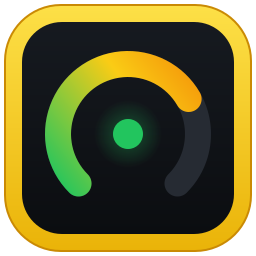
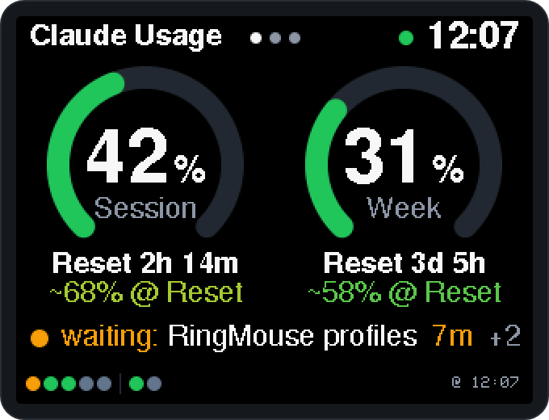
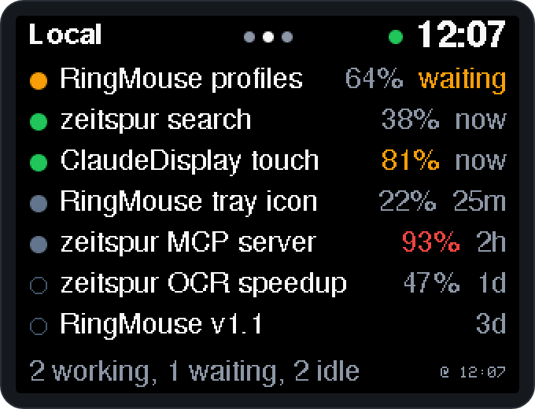
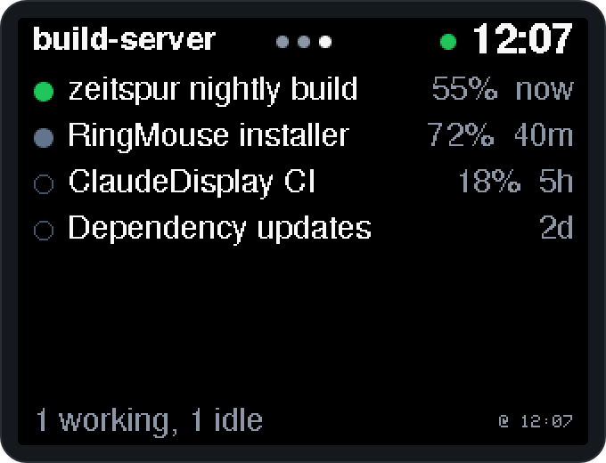

<p align="center">
  
</p>

<h1 align="center">Claude-Usage-Display</h1>

<p align="center">
  Shows your Claude usage (5-hour session and 7-day week) and the status of your running
  Claude Code sessions on an ESP32-2432S028 "Cheap Yellow Display" (CYD).<br>
  Tap a session to open it in Claude Desktop. USB serial only: no Wi-Fi, no token on the device.
</p>

<p align="center">
  <a href="https://github.com/Tim-Schaller/ClaudeDisplay/releases/latest"></a>
  
  
  <a href="LICENSE"></a>
</p>

<p align="center">
  
  
  
</p>

```
Claude CLI (get_usage)  ─┐
~\.claude\sessions       ├─► collector.ps1 ──► USB serial, NDJSON ──► CYD firmware
Desktop session files    │   (Task Scheduler,     115200 baud          3 pages, touch
Remote Control list     ─┘    PowerShell 7)
```

- **Host:** `host/collector.ps1` fetches the usage every 2 minutes, reads the state of the
  local sessions every 2 s and the Remote Control sessions of other machines every 30 s.
  It computes a forecast and sends everything to the display.
- **Display:** three pages (Home → Local → Remote), back to Home after 60 s without a tap.
  Tap a session to open it in Claude Desktop; swipe sideways (or tap anywhere else) to
  switch pages. Full brightness;
  the backlight turns off while Windows is locked.

> **Made for the Claude Desktop app on Windows (Code tab).** This project is not meant
> for setups that only use the Claude Code CLI in a terminal; for those, Claude Code's
> built-in [status line](https://code.claude.com/docs/en/statusline) is the better fit.
> In the background the collector uses the CLI that ships with Claude Desktop; you don't
> install or use the CLI yourself.

> Unofficial community project, not affiliated with or endorsed by Anthropic. Claude is a
> trademark of Anthropic.

## Requirements

- **Board:** ESP32-2432S028 ("Cheap Yellow Display", 320×240, touch). Tested with the
  dual-USB revision (micro-USB + USB-C, ST7789 panel); the original revision with an
  ILI9341 panel has its own build env. USB serial chip CH340, CH9102 or CP2102.
- **PC:** Windows 10/11 with [PowerShell 7.5+](https://aka.ms/powershell). No admin rights needed.
- **Claude:** the Claude Desktop app for Windows with the Code tab, signed in with a
  claude.ai subscription (Pro, Max, Team or Enterprise). With an API key there are no
  usage limits and therefore nothing to show. Setups with only the standalone Claude Code
  CLI are not supported.
- **Only for building from source:** [PlatformIO Core](https://platformio.org/install/cli), easiest through
  the PlatformIO extension for VS Code or the official installer. Both put `pio` into
  `%USERPROFILE%\.platformio\penv\Scripts`, but **not** on the PATH. For the current
  PowerShell session this is enough:
  `$env:PATH += ";$env:USERPROFILE\.platformio\penv\Scripts"`. Alternatively with Python 3:
  `py -m pip install --user platformio`, then use `py -m platformio` instead of `pio`.

## Contents

| Path | Purpose |
|---|---|
| `firmware/` | PlatformIO project: envs `app` (ST7789) and `app-ili9341` = display, `test-st7789`/`test-ili9341` = test image |
| `host/collector.ps1` | Background process: usage, forecast, sessions, `latest.json`, serial |
| `host/claude-cli.ps1` | Finds the Claude CLI (used by `collector.ps1` and the install scripts) |
| `host/install.ps1` | Sets up autostart (Task Scheduler, no admin) and signs in the CLI |
| `host/update.ps1` | Self-update, started from the display's update banner (download, checksum, flash, reinstall) |
| `host/uninstall.ps1` | Undoes everything |
| `setup/` | Setup assistant for the release ZIP (`Setup.cmd`, `Setup.ps1`, `Uninstall.cmd`, `README.txt`) |
| `docs/images/` | Logo and the screenshots in this README |
| `tools/make-release.ps1` | Builds a release into `dist/`: all firmware images (checked for local paths) and the setup ZIP |

## Quick start (plug & play)

1. Download **`ClaudeDisplay-Setup-vX.Y.Z.zip`** from the
   [latest release](https://github.com/Tim-Schaller/ClaudeDisplay/releases/latest) and unpack it
   to a folder you keep (e.g. `Documents\ClaudeDisplay`).
2. Plug the CYD into your PC with a USB **data** cable.
3. Double-click **`Setup.cmd`** and follow the prompts (if Windows asks, choose
   "More info" → "Run anyway").

The setup assistant

- checks Claude Desktop and PowerShell 7 (and offers to install PowerShell 7 from the
  Microsoft Store, no admin rights needed),
- finds the board (CH340, CH9102 or CP2102),
- downloads Espressif's official esptool (pinned version, SHA256-checked) for the duration
  of the setup,
- optionally backs up the board's original firmware into the `backup` folder,
- flashes the display firmware and asks whether the screen looks right; if not, it
  flashes the other panel variant (ST7789 / ILI9341),
- installs the background service, including the one-time browser login to Claude.

Afterwards the display shows your usage within a few seconds. To remove the background
service later, double-click `Uninstall.cmd`.

**Without the assistant:** the release also contains the firmware images on their own.
Each contains bootloader, partition table and app and is written to address `0x0`, e.g.
with the [Espressif web flasher](https://espressif.github.io/esptool-js/) in Chrome/Edge or
with `py -m esptool --chip esp32 --port COMx --baud 460800 write_flash 0x0 <file>`:

| Image | For |
|---|---|
| `claude-display-st7789-vX.Y.Z.bin` | Dual-USB revision (ST7789 panel) |
| `claude-display-ili9341-vX.Y.Z.bin` | Original revision (ILI9341 panel) |
| `test-st7789-vX.Y.Z.bin`, `test-ili9341-vX.Y.Z.bin` | Test image to find out which panel you have (see setup step 2) |

Then install the host part as in setup step 4. If the image looks wrong (inverted colors,
swapped red/blue, rotated), build the firmware yourself with the build flags from setup
step 2.
## Setup (manual / from source)

Run all commands in PowerShell 7 from the project folder (root of this repo); `-d firmware`
tells PlatformIO where the firmware project is. If you downloaded the repo as a ZIP,
Windows marks the scripts as "from the internet"; that is why the commands use
`-ExecutionPolicy Bypass`.

### 1. Back up the original firmware (recommended)

The board ships with a demo program. If you want it back later, back up the whole flash
before flashing for the first time (4 MB, about 2 minutes; `COMx` = the board's port in
Device Manager). The first build downloads the tools (esptool):

```powershell
pio run -d firmware -e app; New-Item -ItemType Directory -Force firmware\backup | Out-Null
```
```powershell
pio pkg exec -p tool-esptoolpy -- esptool.py --chip esp32 --port COMx --baud 460800 read_flash 0 ALL firmware\backup\original-firmware.bin
```

`firmware/backup/` is listed in `.gitignore` and never ends up in the repo.

### 2. Determine the panel type

The CYD revisions use different display controllers. The test image shows labelled color
bars; the right variant has a black background, matching colors and readable text
("<- oben links" = "top left" is in the top-left corner):

```powershell
pio run -d firmware -e test-st7789 -t upload
```

If it looks wrong, try `test-ili9341`. If something is still off, build flags help; they
apply to the app in the same way (set them before building and keep them for the app):

| Problem | Flag |
|---|---|
| White background, negative colors | `$env:PLATFORMIO_BUILD_FLAGS = "-DPANEL_INVERT=1"` |
| Red and blue swapped | `$env:PLATFORMIO_BUILD_FLAGS = "-DPANEL_SWAP_RB=1"` |
| Image rotated or mirrored | `$env:PLATFORMIO_BUILD_FLAGS = "-DROTATION=3"` (0–3 rotated, 4–7 mirrored; default 1) |
| Taps land upside down or in the wrong row | `$env:PLATFORMIO_BUILD_FLAGS = "-DTOUCH_ROTATION=0"` (touch orientation relative to the panel, 0–7; default 4 = vertically flipped). Each tap that opens a session is logged with its position |

Combine several flags with spaces, e.g. `"-DPANEL_INVERT=1 -DROTATION=3"`.

### 3. Flash the firmware

```powershell
pio run -d firmware -e app -t upload
```

For ILI9341 boards use `-e app-ili9341`. PlatformIO finds the port by itself; with several
serial devices attached add `--upload-port COMx`. If the collector is already running it
holds the port: run `Stop-ScheduledTask 'Claude Usage Display'` first and
`Start-ScheduledTask 'Claude Usage Display'` afterwards.

### 4. Install the host part (once, no admin rights)

```powershell
pwsh -NoProfile -ExecutionPolicy Bypass -File .\host\install.ps1
```

The script

1. copies `collector.ps1`, `claude-cli.ps1` and `update.ps1` to `%USERPROFILE%\.usage-display\`,
2. creates the task **"Claude Usage Display"**. It starts at logon via
   `conhost --headless`, so without a visible window,
3. signs in the Claude Code CLI bundled with Claude Desktop if it is not signed in yet
   (`claude auth login`, a one-time browser login with your Claude account). The collector
   uses this CLI in the background; its login is separate from the desktop app's own login,
4. starts the collector.

Optional parameters, e.g. your own page titles (max. 14 characters) such as the name of the
server the remote sessions run on:

```powershell
pwsh -NoProfile -ExecutionPolicy Bypass -File .\host\install.ps1 -LocalLabel "Laptop" -RemoteLabel "my-server"
```

| Parameter | Effect |
|---|---|
| `-LocalLabel`, `-RemoteLabel` | Title of page 1 and 2 (default "Local" / "Remote"); `""` restores the default |
| `-Port COMx` | Use a fixed COM port instead of searching; `""` switches back to automatic |
| `-NoLogin` | Do not start the CLI login |

The values are stored in `%USERPROFILE%\.usage-display\config.json` and survive later
installs. Running the script again is harmless; it is also how you apply a changed
`collector.ps1`. The collector searches the display port automatically (CH340, CH9102,
CP2102) and only uses a port on which the board answers. Other USB serial devices are
skipped for 10 minutes after 6 s without an answer.

### 5. Check

- After about 5–10 s the display shows values, with "@ HH:MM" (time of the last fetch)
  at the bottom.
- Log: `%USERPROFILE%\.usage-display\collector.log`
- Latest values: `%USERPROFILE%\.usage-display\latest.json`

## Where do the numbers come from?

The desktop app does **not** run Claude Code's status line; that only runs in the
terminal REPL. The collector therefore takes the same route the desktop app uses
internally. It briefly starts the Claude CLI in headless mode
(`--print --input-format stream-json --output-format stream-json`), sends the
`get_usage` control request and reads `rate_limits.five_hour` / `seven_day`
(`utilization` 0–100 %, `resets_at`).

- This uses **no** quota, because no request goes to the model.
- The CLI handles sign-in and token refresh itself (`~\.claude\.credentials.json`).
- A token from `claude setup-token` is **not** enough: it only has the `user:inference`
  scope, and fetching usage needs `user:profile`.
- The collector uses the newest CLI version bundled with Claude Desktop
  (`%APPDATA%\Claude\claude-code\<version>\…\claude.exe`; for the MSIX version of the app,
  outside the app at `%LOCALAPPDATA%\Packages\Claude_*\LocalCache\Roaming\Claude\claude-code\…`).
  If a standalone CLI happens to be installed at `%USERPROFILE%\.local\bin\claude.exe`,
  that one is preferred. Without a bundled CLI the collector would also try WinGet and
  the PATH, but that is a fallback, not a supported setup.
  A `CLAUDE_CONFIG_DIR` setting is respected.
- `get_usage` is an internal interface marked as experimental. If Anthropic changes it,
  the display shows the collector's error message in the footer.

**Session status:**
- **Local (page 1):** every running Claude Code session of the desktop app (and any CLI session in a terminal, if you also use one) keeps
  `~\.claude\sessions\<pid>.json` up to date with `busy` / `waiting` / `idle`. The
  collector only reads these `.json` files (never the `.key` files) and checks PID and
  start time. Title and last activity of desktop sessions come from their session files
  (`…\Claude\claude-code-sessions`). Regular chats from the Chat tab cannot be read
  locally and are not shown.
- **Remote (page 2):** sessions on other machines (e.g. a server running Claude Code in a
  terminal) appear when **Remote Control** is enabled there (`/config` → "Enable Remote
  Control for all sessions", or `claude --remote-control`). Each session then registers
  with Anthropic, and the collector fetches the list from
  `GET https://api.anthropic.com/v1/code/sessions`, without any network connection to the
  other machine. To do so it **reads** the CLI's access token from `.credentials.json`:
  read-only, never logged, never refreshed (the CLI does that during the `get_usage` runs)
  and never sent to the display. Strictly speaking, page 2 shows all non-archived sessions
  from that list that cannot be matched to a session on this machine, including ended
  ones (hollow ring). If you don't use Remote Control anywhere, you will mostly see older
  sessions of your own there. The interface is internal and undocumented; if it breaks,
  page 2 shows an error and everything else keeps working.
- Only titles, status and times are shown, never chat content.

## Display

<p align="center"></p>

**Page 0: Home.** Two ring gauges for the 5-hour session and the 7-day week (green up to
50 %, yellow around 80 %, red from 95 %), each with the time until its reset ("Reset 2h
14m", "Reset 3d 5h") and a forecast. Below them the session line; at the bottom one dot
per running session and "@ HH:MM", the time of the last usage fetch. The header shows the
page dots and the clock; the green dot means the data is current.

- **Forecast:** "Limit ~HH:MM" (orange) if, at the average pace since the window started
  (reset minus 5 h or 7 days, starting at 0 %), the limit is reached before the reset,
  with a weekday if that is more than 20 h away; otherwise "~XX% @ Reset", the projected
  value at reset, colored like the gauges. Example: 20 % after 2.6 h → 7.7 %/h → about
  38 % at reset. It only appears 30 min (session) or 12 h (week) after the window started;
  before that it would be too jumpy.
- **Session line:** the session that is waiting for you (orange, "waiting: …"), otherwise
  the one that is working (green, "working: …"), with its title; for a waiting session
  also how long it has been waiting ("7m", red after 10 min); "+2" counts further active
  sessions. Local and remote sessions both count. If all running sessions are idle it says
  "all sessions idle"; without running sessions it is empty.
- **Dots:** local sessions on the left, connected remote sessions after the separator.
  Pulsing green = working, fast-blinking orange = waiting for you, gray = idle. "Waiting"
  means an open permission prompt or question; for local Claude Desktop sessions also a
  finished turn that the app marks yellow ("needs input", e.g. Claude asks for a go-ahead)
  until you open the session. For remote sessions only open prompts count. Clearing the
  yellow dot via "Mark as completed" in the app's menu is not visible to the display.

<p align="center">
  
  
</p>

**Pages 1 (Local) and 2 (Remote):** the last 7 sessions with a status dot (colors as
above, hollow ring = offline/ended), title, how full the session's context window is
("64%", orange from 75 %, red from 90 %; only for sessions with Remote Control, because
the value comes from the remote session list) and the age of the last activity ("now",
"25m", "2h", "3d"; "waiting" for sessions that wait for you). At the bottom a summary,
e.g. "2 working, 1 waiting, 2 idle". Page 2 can have its own title, like "build-server"
above (`install.ps1 -RemoteLabel`).

**Tap to open:** tapping the session line (page 0) or a list row (pages 1/2) opens that
session in Claude Desktop, local and remote sessions alike (remote ones in the app's view
for Remote Control sessions). The row lights up briefly. Terminal sessions cannot be
opened; tapping them, the header, the footer or an empty area switches to the next page.

**Switching pages:** swipe left for the next page, right for the previous one.

**Details (long press):** hold a session row or the session line for about half a second.
A detail sheet shows status and age, where it runs (this PC, terminal, or the remote page's
title), project (local: folder name; remote: repository), branch, model and effort, context
(e.g. "512k / 1M (51%)") and start time (for Claude Desktop sessions with the number of
turns). Remote sessions get their details from the Remote Control session list, so this
works for sessions on other machines too. Any tap closes the sheet; it also closes after
30 s.

**Limit warning:** from 90 % the ring of the session or week gauge pulses, and the display
flashes twice when a value crosses 90 %. At 100 % the forecast line says "Limit reached".
When a new window starts, it shows "New 5h window" or "New week" for a minute.

**"Done" flash:** when a session that worked for at least 10 s finishes (idle or waiting
for you), the whole screen inverts for a quarter of a second. Not while Windows is locked.
Remote sessions are only fetched every 30 s: they flash if two fetches in a row saw them
working (so after about 30 s of work or more), and up to 30 s late.

- **"Waiting for data":** the display has not received anything from the host since it
  started.
- **"Offline":** no message from the host for 90 s ("No data for …"). The last known
  values are shown at the bottom.
- **`--`:** value unknown, e.g. before the first successful fetch.
- **Update banner:** see [Updates](#updates).
- **Brightness:** always 100 %; while Windows is locked the backlight is off. (The light
  sensor is not used: inside a case it reads "dark" even in a normally lit room.)

The screenshots are read straight from a real display (debug build with `-DSCREENSHOT`)
that was fed demo sessions.

## Updates

Every 6 hours the collector asks GitHub for the latest release of this project. If it is
newer than the firmware on the display, the footer of the home page shows "Update x.y.z"
on the right. Tap it (right half of the footer), then tap again within 5 s ("Tap again to
update") to start the update. Firmware built with your own panel flags (`ROTATION`,
`PANEL_INVERT`, `PANEL_SWAP_RB`, `TOUCH_ROTATION`) reports itself as "custom" and gets no
banner, because the release images would replace your flags; update those by hand.
The footer then says "Updating...". `host/update.ps1` runs on its own:

1. downloads the release's setup ZIP and checks its SHA256 against the value GitHub lists
   for the file,
2. downloads Espressif's official esptool 4.12.0 (SHA256-checked, removed afterwards),
3. stops the collector and flashes the firmware for your panel type (the display reports it),
4. installs the new collector (`install.ps1 -NoLogin`; your `config.json` is kept) and starts it.

The display restarts once during this; after about a minute it shows your data again, with
the new version. If anything fails, the previous collector keeps running and
`%USERPROFILE%\.usage-display\update.log` says why. You can always update by hand with
`Setup.cmd` from the new release ZIP. The device itself never goes online; only the PC talks
to GitHub.

## Troubleshooting

| Symptom | Cause / fix |
|---|---|
| Footer "Not signed in: claude auth login" | Run `install.ps1` again; it starts the login |
| Footer "Claude CLI not found" | Is Claude Desktop installed and has its Code tab been opened at least once? The desktop app downloads its bundled CLI there |
| "Waiting for data" stays on screen | Is the task running? `Get-ScheduledTask 'Claude Usage Display'`; also check `collector.log` |
| Log: "Port COMx not available: Access … denied" | Another program holds the port (serial monitor, PlatformIO upload, a second collector). The collector retries every 3 s |
| Display is not found | Device Manager: does "USB-SERIAL CH340 (COMx)" or "CP210x (COMx)" show up? If not, install the chip's driver (WCH CH341SER or Silicon Labs CP210x). Charge-only cable? |
| Board restarts when the port is opened | Happens occasionally (DTR/RTS auto-reset circuit). Harmless: the board sends `hello` and the collector immediately sends the current state |
| Wrong colors or mirrored image | Check panel type and build flags (`PANEL_INVERT`, `PANEL_SWAP_RB`, `ROTATION`), see setup step 2 |
| Log: "No display on COMx (no answer)" | Another USB serial device is on that port, or the board does not run this firmware yet. Flash the firmware or set `install.ps1 -Port COMx` |
| White screen | SPI clock too high. It is set to 27 MHz in `lgfx_cyd.h`; above about 32 MHz the panel initialisation fails on some boards |
| PlatformIO install fails with `CERTIFICATE_VERIFY_FAILED` | A proxy with TLS inspection (common in corporate networks) intercepts the connection. Install outside that network or point `REQUESTS_CA_BUNDLE` to the corporate certificate |
| Numbers differ briefly from claude.ai | The fetch runs every 2 minutes; "@ HH:MM" at the bottom tells you how current they are |
| Remote page: "No CLI login" / "List: login expired" | The CLI login is missing or expired: run `install.ps1` again |
| Remote page: "List unavailable" | No network, or the internal interface has changed. The last list stays on screen |
| Remote page stays empty | Remote Control is not enabled on the other machine, or it uses a different Claude account |
| Update banner: "Updating..." disappears, old version still there | See `%USERPROFILE%\.usage-display\update.log`. Typical causes: no network, the port was busy, or flashing failed (then run `Setup.cmd` from the new release ZIP) |
| Display stays dark although unlocked | "Locked" means `LogonUI.exe` is running. After unlocking, the next update arrives within 2 s |

The log is kept short: start, connect, disconnect, changed values, errors. Repeated
identical errors are logged only once. At 1 MB it is rotated to `collector.log.1`.

## Protocol

One JSON message per line (UTF-8, `\n`), 115200 baud, 8N1. Both sides ignore lines that
do not start with `{` (e.g. ESP32 boot messages). The board drops lines longer than
1023 bytes entirely. Texts are ASCII (umlauts transliterated), because the fonts know
nothing else.

**Host → display**

`state`: on every change, after `hello`, and every 30 s.

```json
{"t":"state","now":1790975844,"tz":120,
 "s":{"p":17.0,"r":1791031800,"f":1790990400},"w":{"p":24.0,"r":1791284400,"f":0,"e":44},
 "at":1790975800,"lock":0,"d":"w|aiii","x":{"s":"a","n":"API client refactoring","m":1,"t":1790975100,"o":1}}
```

| Field | Meaning |
|---|---|
| `now` | Current time, Unix seconds (UTC). The board keeps its clock with it |
| `tz` | Local UTC offset in minutes, including daylight saving time |
| `s`, `w` | Session (5 h) and week (7 d): `p` = used in %, `r` = reset (Unix s), `f` = forecast: time at which 100 % is reached, `0` = not before the reset (then `e` = projected value at reset in %), missing = no forecast yet. If the object is missing, the value is unknown |
| `at` | Time of the last successful fetch (missing until there is one) |
| `err` | Short error text for the footer (ASCII, max. 44 characters). Missing when all is well |
| `lock` | `1` = Windows locked → backlight off (also stays in effect while offline) |
| `d` | Dots: one character per running session, `w` working, `a` waiting, `i` idle; local first, then `\|`, then remote (max. 24) |
| `x` | Session line: `s` = `a` waiting / `w` working / `i` all idle, `n` = title (ASCII, max. 40), `m` = number of further active sessions, `t` = waiting since (Unix s, only for `a`), `o` = `1` if it can be opened on the PC. Missing = no running sessions |

`list`: session list for page `p` (1 = local, 2 = remote), on change and after `hello`.

```json
{"t":"list","p":2,"at":1790975800,"l":"my-server","i":[{"n":"Refactoring API client","s":"i","a":1790890000,"o":1,"c":51}]}
```

Max. 7 entries, newest first. `n` = title (max. 40 characters), `s` = `w` working,
`a` waiting, `i` idle, `o` offline/ended, `a` = last activity (Unix s), `o` = `1` if the
session can be opened on the PC (not for terminal sessions), `c` = context window used in %
(missing = unknown). Optional `err`
(error while fetching) and `l` (custom page title, max. 14 characters).

`state` also carries `u` = version of a newer release on GitHub (missing = none) and
`ux` = `1` while the host is updating; the board then shows the update banner.

`{"t":"detail","n":"Refactoring API client","s":"w","r":[["Status","working, now"],["Model","opus-5-5, max"]]}`:
answer to a detail request: shown title `n`, status `s` and up to 7 rows `r` of
[key, value] (ASCII, value max. 40 characters). `r` is empty if the session is unknown.

`{"t":"done"}`: a session that worked for at least 10 s (remote: in two fetches in a row) has
finished; the display inverts for 250 ms. Not sent while Windows is locked.

**Display → host**

| Message | When |
|---|---|
| `{"t":"hello","fw":"2.7.0","pn":"st7789"}` | After start-up, with firmware version and panel type. The host immediately sends `state` and both `list` |
| `{"t":"ack","s":17.0,"w":24.0,"b":255,"fw":"2.7.0","pn":"st7789"}` | After every `state`: the accepted values, the target brightness `b` (255, or 0 while locked), firmware version and panel type (for the update) |
| `{"t":"detail","p":1,"i":2,"n":"Refactoring API client"}` | A session was held (long press), same fields as `open`. The host answers with `detail` |
| `{"t":"update"}` | The update banner was tapped twice. The host starts `update.ps1` |
| `{"t":"open","p":1,"i":2,"n":"Refactoring API client","x":160,"y":95}` | A session was tapped: page `p`, row `i` (`-1` = session line), shown title `n`, tap position `x`/`y`. The host takes row `i` of the list it last sent if the title matches (otherwise it searches by title) and opens `claude://claude.ai/epitaxy/<id>` (local) or `claude://claude.ai/code/<id>` (remote, `cse_` becomes `session_`) in Claude Desktop. It logs page, row and position, never the title |

**Timing:** usage every 120 s (in the background), local sessions every 2 s (Claude Desktop
session files every 4 s), remote list every 30 s, lock
state every 2 s, heartbeat every 30 s, offline screen after 90 s without `state`, release check every 6 h.
The board computes the countdowns itself from `r` and the clock set by the host.

## Uninstall

Mind the order: restoring the original firmware needs PlatformIO (esptool).

**1. Optional: restore the original firmware** (the file backed up in setup step 1).
Stop the collector first (`Stop-ScheduledTask 'Claude Usage Display'`).

```powershell
pio pkg exec -p tool-esptoolpy -- esptool.py --chip esp32 --port COMx --baud 460800 write_flash 0 firmware\backup\original-firmware.bin
```

**2. Remove the host part:**

```powershell
pwsh -NoProfile -ExecutionPolicy Bypass -File .\host\uninstall.ps1
```

Removes the task, stops the collector and deletes `%USERPROFILE%\.usage-display`.
Optional switches:

- `-Logout` also signs out the Claude CLI.
- `-RemovePlatformIO` also deletes `%USERPROFILE%\.platformio`. Only use it after step 1,
  and only if you installed PlatformIO just for this project: the folder also holds the
  tools of other PlatformIO projects and of the VS Code extension.

This project does not modify `~\.claude\settings.json`.

## Hardware notes

- Tested with ESP32-D0WD-V3, 4 MB flash, CH340 (VID 1A86, PID 7523).
- Panel of the dual-USB revision: ST7789 family (controller ID `81 81 B3`, read back via
  SPI), no inversion, BGR, rotation 1 = landscape 320×240.
- SPI: SCLK 14, MOSI 13, MISO 12, CS 15, DC 2, no reset pin. Backlight GPIO 21 (PWM).
  Touch (XPT2046): CLK 25, MOSI 32, MISO 39, CS 33, IRQ 36.
- Without a reset pin the panel keeps its registers until power is removed. The firmware
  therefore resets it by software at start-up and then writes `B6h` (gate scan
  direction). This way the image is the same after every restart, whatever firmware ran
  before.
- Auto-reset circuit: RTS → EN, DTR → GPIO0. That is why the collector opens the port
  with `DtrEnable = RtsEnable = false`.

Some of the pin and clock findings were inspired by the
[Blink](https://github.com/KfirLevy258/Blink) project. No code was taken from it.

## License

MIT with the "Commons Clause": you may use, modify and share it freely, but selling it or
offering paid products or services whose value derives substantially from this software
is not allowed. See [LICENSE](LICENSE) for details.
